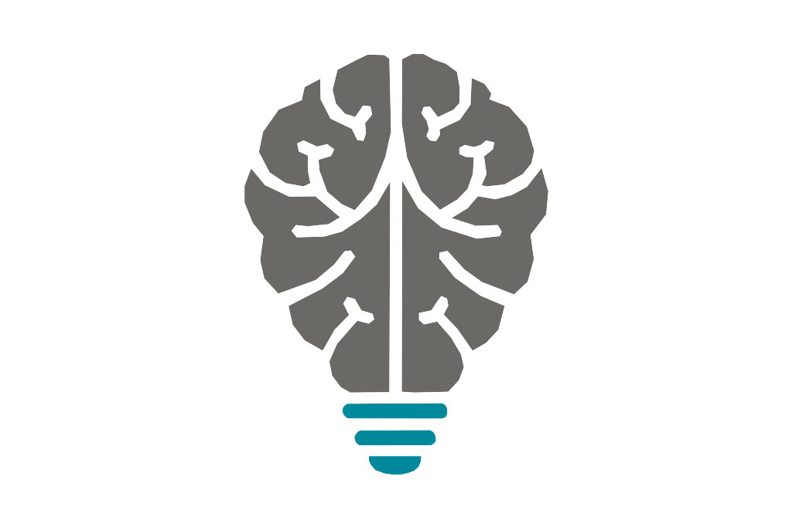
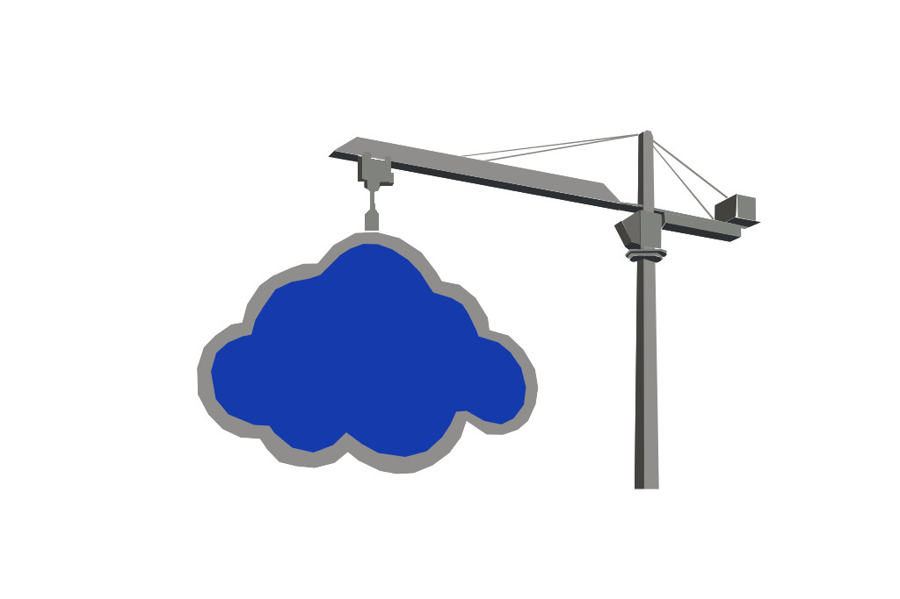
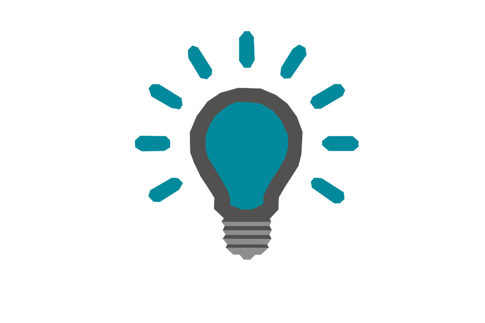

# RobocarRally - lab

Compete agains your Jayway collegues in this AI-controlled car race.

You'll be divided up in 4 teams with 4 people per team. Each team will be given a `Robocar` to name and race with.

## Prerequisites

You should be familiar with at least some of the technologies listed below:

| Tech      |
| --------- | 
| Python |
| Raspberry pi / Rasbian |
| Tensorflow / Keras |
| AI/ML theory |
| AWS IoT |
| AWS SageMaker |
| AWS CloudFormation |
| Bash |

## Preparations

You'll need to do the following before starting the lab:

1. All team members should have access to the [AWS account](https://648414911232.signin.aws.amazon.com/console). Contact either of the lab assistants with the following info:
   - Name of the team
   - Team members
1. Each team member must set up the AWS CLI and be able to access the account both via the [CLI](https://aws.amazon.com/cli) and the [web console](https://648414911232.signin.aws.amazon.com/console).
1. Clone this repository
   - `git clone https://github.com/jayway/robocar-rally-lab`
1. When all the above is done, you'll be given a car.

## Instructions

| [Prepare car](docs/PREPARE-CAR.md)          |
|     :---:                                   |
|  |

| [Drive](docs/DRIVE-CAR.md)                      |
|     :---:                                       |
|  |

| [Train](docs/AI.md)                             |
|     :---:                                       |
|  |

| [Prepare IoT environment](docs/PREPARE-IOT.md)  |
|     :---:                                       |
|       |

| [Tips n Tricks](docs/TIPS-N-TRICKS.md)          |
|     :---:                                       |
|   |
