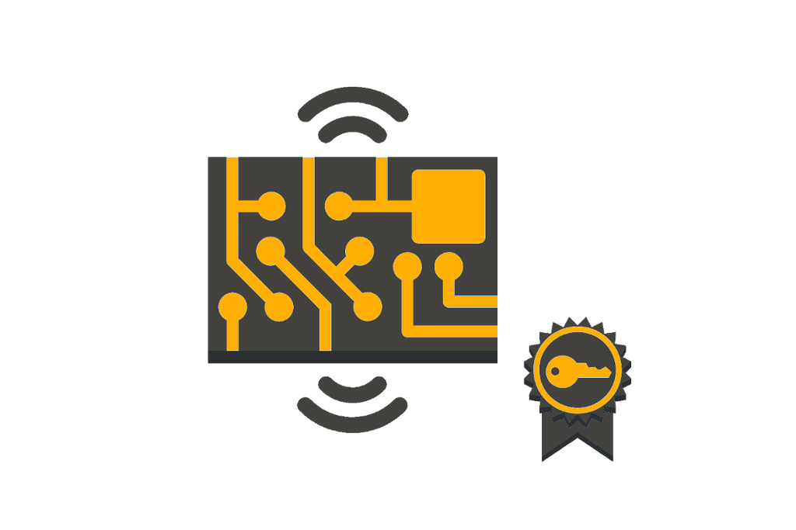
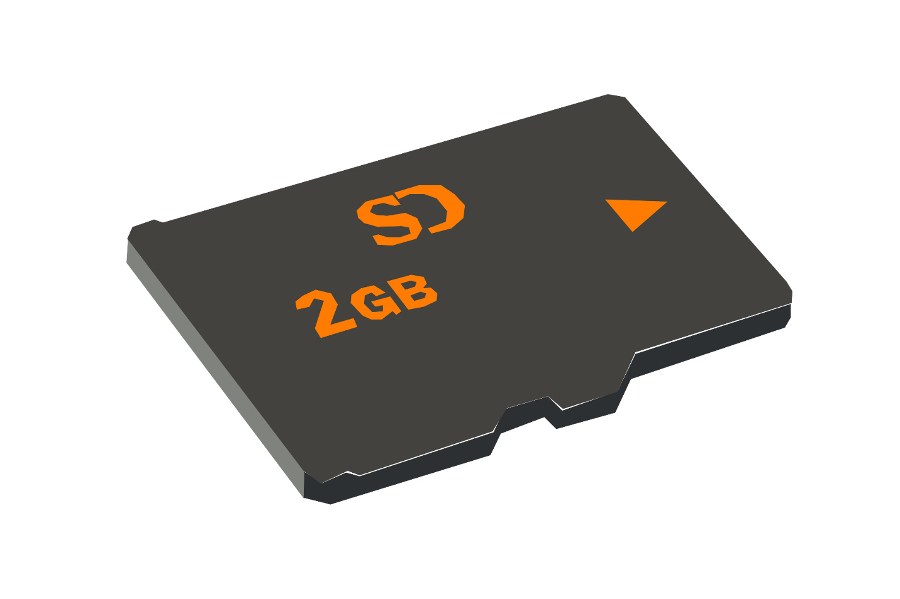

# RobocarRally - lab

Compete agains your Jayway collegues in this AI-controlled car race.

You'll be divided up in 4 teams with 4 people per team. Each team will be given a `Robocar` to name and race with.

## Prerequisites

It helps to be familiar with at least some of the technologies listed below:

| Tech      |
| --------- | 
| Python |
| Raspberry pi / Rasbian |
| Tensorflow / Keras |
| AI/ML theory |
| AWS IoT |
| AWS SageMaker |
| AWS CloudFormation |
| Bash |

## Preparations

You'll need to do the following before starting the lab:

1. All team members should have access to the [AWS account](https://648414911232.signin.aws.amazon.com/console). Contact the lab assistants if you haven't received your credentials.
1. Each team member must set up the AWS CLI and be able to access the account both via the [CLI](https://aws.amazon.com/cli) and the [web console](https://648414911232.signin.aws.amazon.com/console).
1. Clone this repository
   - `git clone https://github.com/jayway/robocar-rally-lab`
1. Decide on a *car name*
1. When all the above is done, you'll be given a car.

## Instructions

<!-- The drive track -->
### The *Drive* track

<a href="/docs/DRIVE-CAR.md">

<a/>

### The *ML* track

  
  <figcaption>
    <a href="/docs/PREPARE-CAR.md">1. Prepare car</a>
  </figcaption>

  

  
  <figcaption>
    <a href="/docs/DRIVE-CAR.md">2. Drive car</a>
  </figcaption>

  

---

<!-- The ai track -->

  
  <figcaption>
    <a href="/docs/AI.md">1. Train</a>
  </figcaption>

---

<!-- The iot track -->

  
  <figcaption>
    <a href="/docs/PREPARE-IOT.md">1. Prepare IoT</a>
  </figcaption>

  

  
  <figcaption>
    <a href="/docs/CODING-IOT.md">2. Coding IoT</a>
  </figcaption>

---

<!-- Help and tips -->

  
  <figcaption>
    <a href="/docs/TIPS-N-TRICKS.md">Tips n Tricks</a>
  </figcaption>

  
  <figcaption>
    <a href="/docs/HELP.md">Help n Debug</a>
  </figcaption>

## Preparations for lab instructors

<!-- IoT backend setup -->

  
  <figcaption>
    <a href="/docs/CREATE-JITR.md">1. Setup Just-In-Time-Registration</a>
  </figcaption>

  

  
  <figcaption>
    <a href="/docs/CREATE-IOT-ENV.md">2. Create IoT backend</a>
  </figcaption>

<!-- Car preparation -->

  
  <figcaption>
    <a href="/sdcard/README.md">SD card</a>
  </figcaption>

