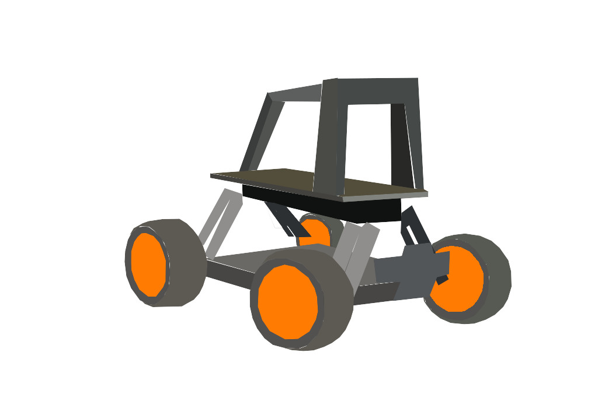
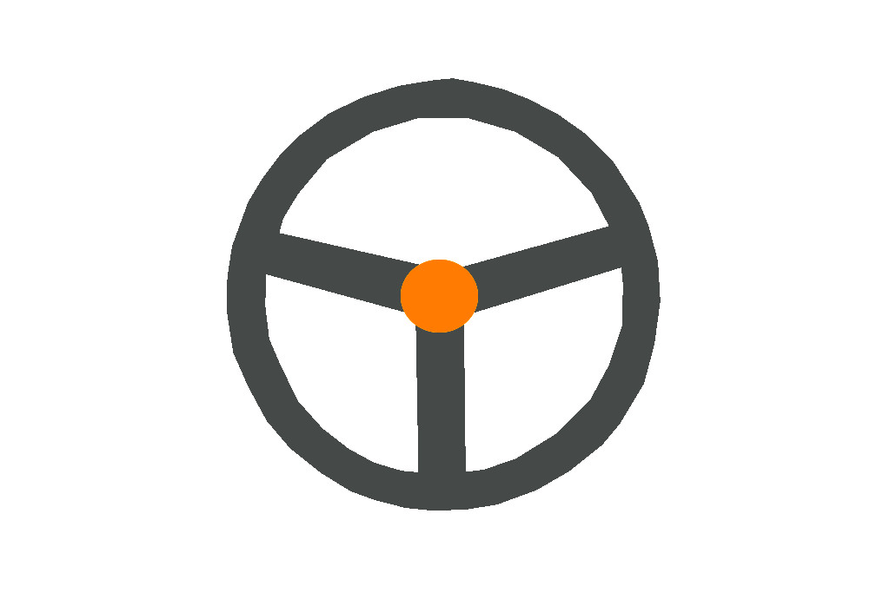

# RobocarRally - lab

Compete agains your Jayway collegues in this AI-controlled car race.

You'll be divided up in 4 teams with 4 people per team. Each team will be given a `Robocar` to name and race with.

## Prerequisites

You should be familiar with at least some of the technologies listed below:

| Tech      |
-------------
| Python |
| Raspberry pi / Rasbian |
| Tensorflow / Keras |
| AI/ML theory |
| AWS IoT |
| AWS SageMaker |
| AWS CloudFormation |
| Bash |

## Preparations

You'll need to do the following before starting the lab:

1. Create or re-use an AWS account for this lab. Make sure it is added to the Jayway organization for consolidated billing.
1. Give all team members access, i.e. create IAM users with proper permissions.
1. Each team member must set up the AWS CLI and be able to access the account both via the CLI and the web console.
1. Clone this repository.

## Instructions

| [Prepare car](docs/PREPARE-CAR.md)          |
|     :---:                                   |
|  |

| [Driving](docs/DRIVE-CAR.md)                    |
|     :---:                                       |
|  |