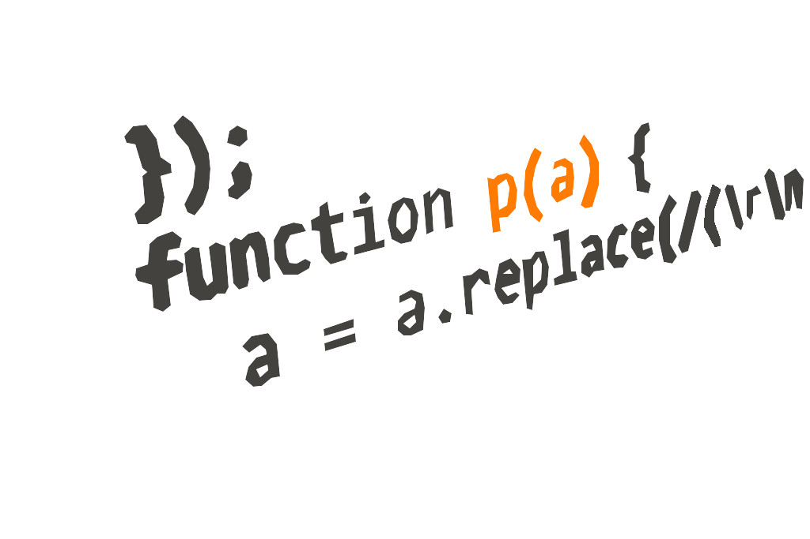

# RobocarRally - lab

Compete agains your Jayway collegues in this AI-controlled car race.

You'll be divided up in 4 teams with 4 people per team. Each team will be given a `Robocar` to name and race with.

## Prerequisites

It helps to be familiar with at least some of the technologies listed below:

| Tech      |
| --------- | 
| Python |
| Raspberry pi / Rasbian |
| Tensorflow / Keras |
| AI/ML theory |
| AWS IoT |
| AWS SageMaker |
| AWS CloudFormation |
| Bash |
| Electronics and soldering |

## Preparations

You'll need to do the following before starting the lab:

1. All team members should have access to the [AWS account](https://648414911232.signin.aws.amazon.com/console). Contact the lab assistants if you haven't received your credentials.
1. Each team member must set up the AWS CLI and be able to access the account both via the [CLI](https://aws.amazon.com/cli) and the [web console](https://648414911232.signin.aws.amazon.com/console).
1. Clone this repository
   - `git clone https://github.com/jayway/robocar-rally-lab`
1. Decide on a *car name*
1. When all the above is done, you'll be given a car.

## Instructions

The lab instructions are divided up in 3 *tracks*, which the team can run in parallell.

In the *Drive* track, you'll prepare the car for racing. You'll need to work with the [Raspberry Pi](https://www.raspberrypi.org/) that runs the car, calibrate the [PWM motor controller](https://en.wikipedia.org/wiki/Pulse-width_modulation) for steering and throttle, and finally drive the car using a remote control. It's your job to generate good data for the deep learning algorithm to train on. You'll also run the car autonomously using the trained model.

In the *ML* track, you'll dig into the training of the car. You'll look at the data produced by the car when driving manually (the *Drive* track), get familiar with the [Donkey python library](https://github.com/wroscoe/donkey) and the tools it provides for working with the data, then train and evaluate your first model using a sample data set in [AWS SageMaker](https://aws.amazon.com/sagemaker/). Finally, you'll dig deeper into the neural network to see if it can be improved in some way.

In the *IoT* track, you'll look at the collecting and reporting of metrics to the cloud. You'll provision the car for authenticating with [AWS IoT](https://aws.amazon.com/iot/) service using JITR, then start coding your own [Donkey python library](https://github.com/wroscoe/donkey) part to report data you think is important to the cloud. You'll also work with the data pipeline already present in the AWS account to visualize your data using tools like [Grafana](https://grafana.com/).

### The *Drive* track

<table align="center">
<tr>
  <td align="center">
    
     
    <a href="/docs/PREPARE-CAR.md">1. Prepare car</a>
  </td>
  <td align="center">
    
  </td>
  <td align="center">
    <a href="/docs/DRIVE-CAR.md"><a/>
       
    <a href="/docs/DRIVE-CAR.md">2. Drive car</a>
  </td>
</tr>
</table>

### The *ML* track

<table align="center">
<tr>
  <td align="center">
    
     
    <a href="/docs/AI.md">1. Getting started</a>
  </td>
  <td align="center">
    
  </td>
  <td align="center">
    <a href="/ml/donkey-intro.ipynb"><a/>
     
    <a href="/ml/donkey-intro.ipynb">2. Sagemaker Donkey intro</a>
  </td>
  <td align="center">
    
  </td>
  <td align="center">
    <a href="/ml/donkey-tools.ipynb"><a/>
     
    <a href="/ml/donkey-tools.ipynb">3. Donkey tools</a>
  </td>
  <td align="center">
    
  </td>
  <td align="center">
    <a href="/ml/donkey-train.ipynb"><a/>
     
    <a href="/ml/donkey-train.ipynb">4. Sagemaker training</a>
  </td>
</tr>
</table>

### The *IoT* track

<table align="center">
<tr>
  <td align="center">
    
     
    <a href="/docs/PREPARE-IOT.md">1. Prepare IoT</a>
  </td>
  <td align="center">
    
  </td>
  <td align="center">
    <a href="/docs/CODING-IOT.md"><a/>
     
    <a href="/docs/CODING-IOT.md">2. Code IoT</a>
  </td>
</tr>
</table>

## Help and tips

<table align="center">
<tr>
  <td align="center">
    
     
    <a href="/docs/TIPS-N-TRICKS.md">Tips n Tricks</a>
  </td>
  <td align="center">
    <a href="/docs/HELP.md"><a/>
     
    <a href="/docs/HELP.md">Help n Debug</a>
  </td>
</tr>
</table>

## Preparations for lab instructors

<table align="center">
<tr>
  <td align="center">
    
     
    <a href="/sdcard/README.md">SD card</a>
  </td>
  <td align="center">
    
     
    <a href="/docs/CREATE-JITR.md">Setup JITR</a>
  </td>
  <td align="center">
    <a href="/docs/CREATE-IOT-ENV.md"><a/>
     
    <a href="/docs/CREATE-IOT-ENV.md">Create IoT backend</a>
  </td>
</tr>
</table>