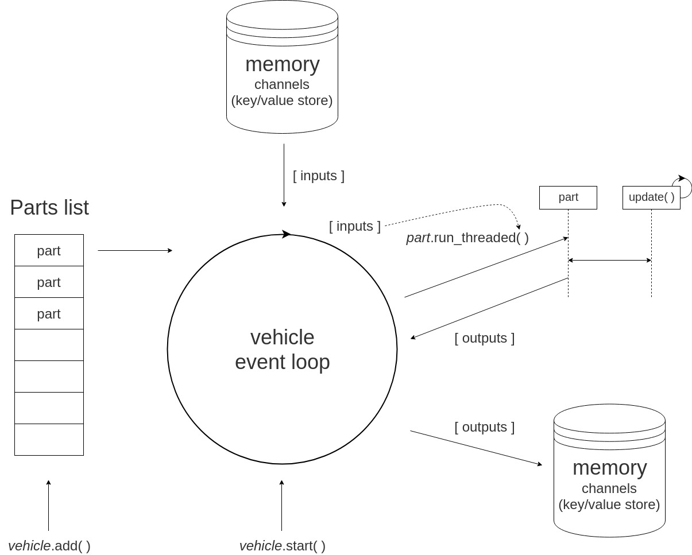

# Code IoT

The car uses the [Donkey](https://github.com/wroscoe/donkey) library to drive and train the car. The library runs an event loop that execute tasks called `parts`. Since much of the data that is interesting to the IoT backend flows through the library, this is where we need to \'hook in\'.

This part of the lab explains how to create a custom *Donkey library part*. See introduction here:

http://docs.donkeycar.com/parts/about/

## Development environment

We can recommend one of the two following approaches:
1. `ssh` to the car and code directly on the car using a simple editor like `vim` or `nano`.
1. Set up a local development environment on your host computer, and create a dummy car using the `create-device-cert.sh` script. When done, copy the code to the car using `scp`.
   - **Note:** requires you to install a new python environment to mimick the car. If this sounds tedious, choose option 1. Otherwise, follow the instructions below.

### Install Donkey library and dependencies

Follow the instructions in the Donkey library instructions:

- [http://docs.donkeycar.com/guide/install_software/#install-donkeycar-on-linux](http://docs.donkeycar.com/guide/install_software/#install-donkeycar-on-linux)

### Create a dummy IoT device

You need to specify a directory where the script outputs the AWS IoT certificates and config file:
```bash
mkdir -p $HOME/tmp/donkey-dev
./<robocar-rally-lab>/provisioning/create-device-cert.sh -d <unique dummy name> -l $HOME/tmp/donkey-dev
```

To verify that it works, in the [AWS console](https://648414911232.signin.aws.amazon.com/console), in the IoT service left navigation pane, choose **Test**. Subscribe to the `Donkey/hello` topic.


Then run an iot application using the dummy certificate:
```bash
export IOT_CONFIG_PATH=$HOME/tmp/donkey-dev/config.json
cd <robocar-rally-lab>/iot
npm start
```

The node application will publish a *hello* message to the `Donkey/hello` topic when connected to the AWS IoT service.

Type `CTRL-D` when your done.

## Create a new Donkey part

Create a new file to the donkey library:
```bash
<donkey library>/donkeycar/parts/iot.py
```

Paste the following:
```python
import random
import time

class Iot:
  def __init__(self):
    self.input = 0
    self.output = 0

  def run(self, x):
    return x * random.random()

  def run_threaded(self, x):
    self.input = x
    return self.output

  def update(self):
    '''the funtion run in it's own thread'''
    while True:
      self.output = self.run(self.input)
      time.sleep(1)

  def shutdown(self):
    pass
```

This snippet is taken from [http://docs.donkeycar.com/parts/about/#anatomy-of-a-part](http://docs.donkeycar.com/parts/about/#anatomy-of-a-part)

For local dev environment, create a project dir (if it doesn't already exist):
```bash
mkdir -p $HOME/tmp/donkey-dev
cd $HOME/tmp/donkey-dev
```

For on-device environment, simply navigate to the `/home/pi/d2` directory:
```bash
cd /home/pi/d2
```

Create a new main script to test your new part, e.g. `test.py`:
```python
#!/usr/bin/env python3

import donkeycar as dk
from donkeycar.parts.iot import Iot


def main(cfg):
  V = dk.vehicle.Vehicle()

  # Add iot part
  V.mem['const'] = 9
  V.add(Iot(), inputs=['const'], outputs=['const'], threaded=True)
  
  #run the vehicle
  V.start(rate_hz=cfg.DRIVE_LOOP_HZ, 
          max_loop_count=cfg.MAX_LOOPS)


if __name__ == '__main__':
  cfg = dk.load_config()
  main(cfg)
```

For local environment, copy the standard `config_defaults.py` file from Donkey project:
```bash
cp <donkey library>/donkeycar/templates/config_defaults/py $HOME/tmp/donkey-dev/config.py
```

Run:
```bash
python test.py
```

If this works ok, we need to dig a bit deeper into the donkey architecture before adding more functionality.

## Donkey library architecture

The main loop can be found in the [vehicle.py](https://github.com/wroscoe/donkey/blob/master/donkeycar/vehicle.py) file, and it's a good place to start looking at the architecture. Take a few minutes to read through the file...

It's a simple loop over all parts added to the `Vechicle`. For each part, it basically does the following:

1. Fetch *inputs* from memory. Inputs are organized by "channel", which is simply a key in a dictionary. Some parts don't have *inputs*.
1. Calls the `run_threaded()` (or `run()` if the part is not threaded) method on the part, passing in any *inputs*. If the part is expected to return *outputs*, it does so in the same call.
   - If the part is threaded, there is a thread running the `update()` method concurrently with the vehicle event loop. Thus, the part need to provide some way of synchronizing inputs and outputs with the thread.
1. Stores any *outputs* from the part back to memory.



## Connect the new part to AWS IoT

Let's hook up the part to AWS IoT. We'll keep the `test.py` setup from before, but replace the code in `<donkey library>/donkeycar/parts/iot.py`.

The SDK we're going to use is called [AWSIoTPythonSDK](https://github.com/aws/aws-iot-device-sdk-python).

Install the SDK:
```bash
pip install AWSIoTPythonSDK
```

Next, we need to import the `config.json` file with the AWS IoT client information (e.g. x509 certificate and MQTT client ID). On the car, it is located under `/home/pi/certs/config.json` per default. If you [generated a dummy car](#create-a-dummy-iot-device), it is located in the directory you specified, probably `$HOME/tmp/donkey-dev`.

If your using a local environment, append the path to `config.json` to the `config.py` file:
```python
#JOYSTICK
USE_JOYSTICK_AS_DEFAULT = False
JOYSTICK_MAX_THROTTLE = 0.25
JOYSTICK_STEERING_SCALE = 1.0
AUTO_RECORD_ON_THROTTLE = True

#IOT (Change path to fit your environment)
IOT_CONFIG_PATH = os.path.join(CAR_PATH, 'config.json')
```

Clear `<donkey library>/donkeycar/parts/iot.py` and add the following to the top of the file:
```python
import os
import json
import threading
from collections import namedtuple
from AWSIoTPythonSDK.MQTTLib import AWSIoTMQTTClient

def read_config(path):
  if not os.path.isfile(path):
    raise ValueError('Invalid config path {path}')
  with open(path) as f:
    return json.load(f, object_hook=lambda d: namedtuple('car', d.keys())(*d.values()))
```

Next, add the IoT class template:
```python
class Iot:
  '''
  Publishes interesting metrics to AWS IoT
  '''
  def __init__(self, config_path='/home/pi/certs/config.json'):
    c = read_config(config_path)
    print(c)
    self.client = AWSIoTMQTTClient(c.ClientId)
    self.client.configureEndpoint(c.Host, c.Port)
    self.client.configureCredentials(c.CaCert, c.PrivateKey, c.ClientCert)
    self.topic = '{}/{}'.format(c.ThingTypeName, c.ThingName)
    self.on = True
    self.client.connect()

  def run(self, angle, throttle):
    self.publish(angle, throttle)

  def run_threaded(self, angle, throttle):
    '''Using naive synchronization, i.e. shared variables, between threads. Can be improved'''
    self.angle = angle
    self.throttle = throttle

  def update(self):
    '''Target callable of the worker thread'''
    while not self.exit_flag.wait(timeout=self.interval):
      self.publish(self.angle, self.throttle)

  def publish(self, angle, throttle):
    payload = json.dumps({'angle': angle, 'throttle': throttle })
    print('Publishing {} to {}'.format(payload, self.topic))
    self.client.publish(self.topic, payload, 0)

  def shutdown(self):
    self.exit_flag.set()
    self.client.disconnect()
```

As you can see, it defaults to `/home/pi/certs/config.json`, but it is possible for you to override.

## The next step is up to you

Now, it's up to you to improve your part and/or add more metrics to the reporting.