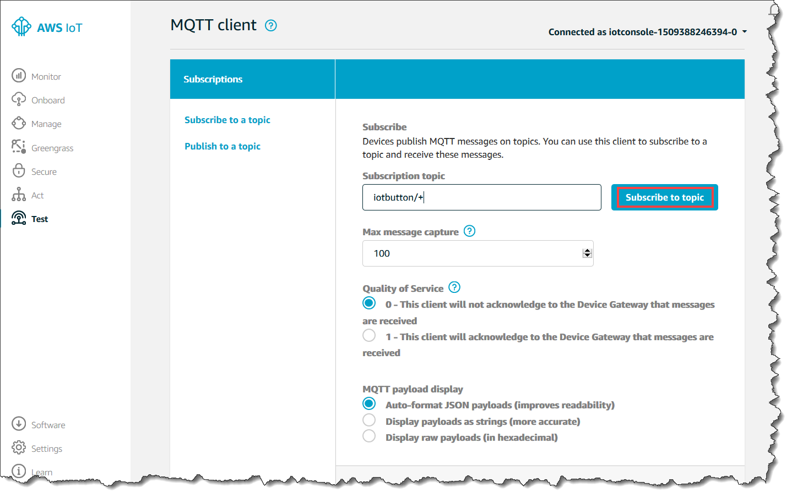

# Prepare the car

For this lab, we use a customized Raspbian image based on the [Donkey Car](https://github.com/wroscoe/donkey) project. See [Debug](#debug) for details on how it was created.

## Install sd-card

Install [Etcher](https://etcher.io/) and copy the customized Raspbian image from [s3://robocar-rally-lab/donkey.img](s3://robocar-rally-lab/donkey.img) to the SD-card, or use a tool like `dd`.


Install the SD-card in the *Raspberry pi* and boot it up.

More information on the [SD-card](../sdcard/README.md).

## Connect to pi

### Direct connect

A new and easy way of connecting w.o. the need of a monitor/keyboard or local wifi router is to use direct ethernet connection (it makes use of diffent techniques such as *Auto MDI-X*, *DHCP* and *IPv4 settings*) :

1. Connect a TP-cable between your computer and the Pi.
2. On Linux, change/create the *wired connection* settings on your computer to *link-local*/*Share to other computers* or similar. On Ubuntu 17.10, you need to start the old network manager using `nm-connection-editor` in the console.
3. SSH is already enabled on the image, and a local IP-address is assigned to the Pi using DHCP as soon as the TP-cable is attached. You can now connect using default username and hostname, and password *pi*.

```bash
ssh pi@raspberrypi.local
```

If this doesn't work, try find the IP-address of the `pi` by e.g. looking in the DHCP leases table:

```bash
cat /var/lib/misc/dnsmasq.leases
```

### Wifi

#### Bonjour

Once the `pi` is connected to wifi (see [Configure network](#configure-network)), you can SSH to it, but it can be a bit tricky to find its IP-address.

If you're on a Mac and have given your `pi` a unique hostname (see [Configure network](#configure-network)), chances are that *Bonjour* already resolved the hostname. Try connect to it using:

```bash
ssh pi@<hostname>.local
```

If you're still using the default hostname `raspberrypi`, it will probably collide with the other teams.

#### Direct connect

If you're still connected using [direct connect](#direct-connect), you'll find the IP-address on the `pi` by typing:

```bash
ifconfig
```

Then simply SSH to it (from your host computer, duh):

```bash
ssh pi@<ip addr>
```

#### nmap

The really slow way is to search the network for all devices with port 22 (SSH) open. Since *JaywayGuest* is a /16 type network, there are 16382 subnets and 65534 hosts to search, which will take around 20 minutes:

```bash
nmap -sS -T5 -p 22 10.0.0.0/16
```

See [https://explainshell.com/explain?cmd=nmap+10.0.0.1+-T5+-p-+-sS+](https://explainshell.com/explain?cmd=nmap+10.0.0.1+-T5+-p-+-sS+) for a description of the `nmap` options.

## Configure network

Make sure the pre-configured wifi settings in `/etc/wpa_supplicant/wpa_supplicant.conf` are correct by opening it in a editor, e.g:

```bash
sudo nano /etc/wpa_supplicant/wpa_supplicant.conf
```

It should look something similar to:

```bash
country=SE
ctrl_interface=DIR=/var/run/wpa_supplicant GROUP=netdev
update_config=1
network={
  ssid="JaywayGuest"
  psk="jaywayguest"
}
```

Next, update `hostname` to reflect your team name:
```bash
sudo nano /etc/hostname
sudo nano /etc/hosts
```

Reboot the pi.
```bash
sudo reboot now
```

## Calibration

The lab uses a python library called [Donkey](https://github.com/wroscoe/donkey) to drive and train the car:
- [https://github.com/wroscoe/donkey](https://github.com/wroscoe/donkey)

Its already installed in `/home/pi/donkey` and `/home/pi/d2`.

You need to calibrate the steering before it can drive properly, see:
- [http://docs.donkeycar.com/guide/calibrate/](http://docs.donkeycar.com/guide/calibrate/)

The library reference can be found here:
- [http://docs.donkeycar.com/utility/donkey](http://docs.donkeycar.com/utility/donkey)

## AWS IoT provisioning

### Create an SSH key for IoT onboarding

Create an RSA key for the IoT onboarding script:

```bash
ssh-keygen -t rsa -f ~/.ssh/robocar_rsa -N ''
```

Copy the public key to the car:
```bash
cat ~/.ssh/robocar_rsa.pub | ssh pi@<hostname>.local "cat >>.ssh/authorized_keys"
```

Don't forget to share the private key with the others in the team.

### Create a device certificate

The car needs a unique [AWS IoT device certificate](https://docs.aws.amazon.com/iot/latest/developerguide/x509-certs.html) to connect to AWS IOT service. Run the following script on your **host** machine:
```bash
cd <?>/robocar-rally-lab/provisioning
./create-device-cert.sh -d <your device/hostname>
```

The certs will automatically be copied to your device using the `SSH` key created in [Create an SSH key for IoT onboarding](#create-an-ssh-key-for-iot-onboarding).

There is a small *NodeJS* app pre-installed on the car that will publish a `hello` message on a particular topic in AWS IOT when it is able to connect to the AWS IoT service.

To verify that the car is properly configured, in the [AWS console](https://648414911232.signin.aws.amazon.com/console), in the IoT service left navigation pane, choose **Test**. Subscribe to the `DonkeyCar/hello` topic.

 

Reboot the car.

You will find the app in the following path on the car:
```bash
/home/pi/iot/index.js
```

## Debug

### SD-card/Raspbian image

See [SD-card README](../sdcard/README.md)

### AWS IoT provisioning

- jobs
-- update SW:
--- apt-get update/upgrade
--- npn
- hello
   ```bash
   DonkeyCar/hello
   ```
