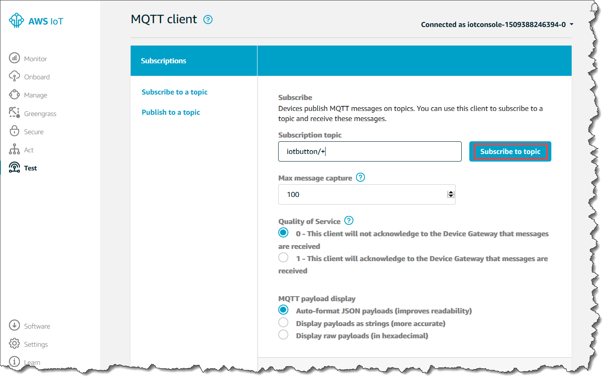

# Prepare AWS IoT

Before starting this part of the lab, make sure you have the [CLI](https://aws.amazon.com/cli) properly installed and configured for the [lab account](https://648414911232.signin.aws.amazon.com/console).

To see your current config, type:
```bash
aws configure list
```

There should be a an `s3` bucket called `robocar-rally-lab`:
```bash
aws s3 ls | grep robocar-rally-lab
# 2018-01-05 09:46:05 robocar-rally-lab
```

You also need either the IP address or the *car name* from the [prepare car](PREPARE-CAR.md#configure-wifi-and-hostname) 

## Create an SSH key for IoT onboarding

Before continuing, you need:
- an SSH connection to the car (either TP-cable or wifi)
- *car name* (hostname) or *IP address*

Create an RSA key for the IoT onboarding script:

```bash
ssh-keygen -t rsa -f ~/.ssh/robocar_rsa -N ''
```

Copy the public key to the car (if using `hostname`):
```bash
cat ~/.ssh/robocar_rsa.pub | ssh pi@<car name>.local "cat >>.ssh/authorized_keys"
```

Or if using an IP-address:
```bash
cat ~/.ssh/robocar_rsa.pub | ssh pi@<IP address> "cat >>.ssh/authorized_keys"
```

Next, share the private RSA key with the others in your team. They should put it in `$HOME/.ssh/robocar_rsa`.

**You can now all use this key to SSH to the car without typing in the password everytime.**

## Create a device certificate

The car needs a unique [AWS IoT device certificate](https://docs.aws.amazon.com/iot/latest/developerguide/x509-certs.html) to connect to AWS IOT service. Run the following script on your **host** machine:
```bash
cd <robocar-rally-lab root>/provisioning
./create-device-cert.sh -d <your car name> -i <ip address (if .local is not working)>
```

The certs will automatically be copied to your device using the `SSH` key created in [Create an SSH key for IoT onboarding](#create-an-ssh-key-for-iot-onboarding).

## IoT app

There is a [service](../iot/index.js) written in *NodeJS* pre-installed on the car that initially will do the following:

- start on boot
- publish its `hostname` (i.e. car name) on the `Donkey/hello` AWS IOT topic when it is able to connect to the AWS IoT service.
- publish its cpu and memory statistics to the `Donkey/<car name>` topic every second.

To verify that the car is properly configured, in the [AWS console](https://648414911232.signin.aws.amazon.com/console), in the IoT service left navigation pane, choose **Test**. Subscribe to the `Donkey/hello` topic.

 

**Ask your team members if you can reboot the car!**:
```bash
# Ask your team members before rebooting...
sudo reboot now
```

## The next step is up to you

You can now modify the `iot` application in any way you like.

A first suggestion to get started is to add *throttle* and *steering angle* to the information reporting.

```bash
ssh pi@<your robocar>
nano $HOME/robocar-rally-lab/iot/index.js
```

Make the necessary changes and reboot the car.