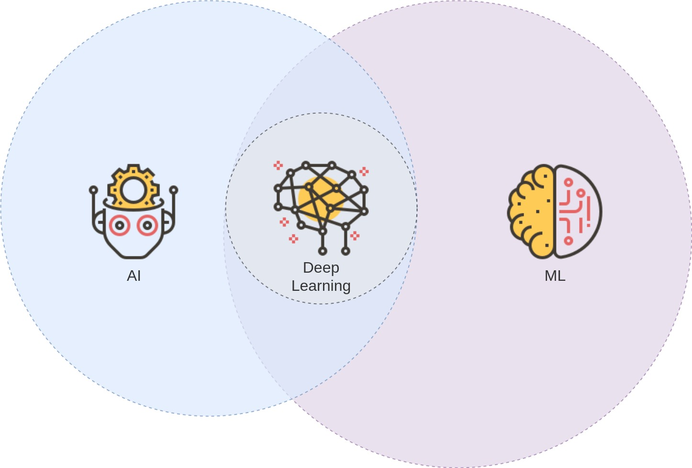

<!-- $theme: default -->

---

# Deep learning
###### Crash course

---

[ai]: <> (Intelligent through rules)
[ml]: <> (Self learning algorithm that train models using data)
[dl]: <> (ML using neural networks. Feature extraction done by network, not by human as in ML.)

---

### When to use Machine Learning?

---

### Machine Learning

- data (x)
- model (f)
- loss function
- an algorithm to tweak the model params so that the loss function is minimized

---

### Supervised vs unsupervised vs reinforced
### Behavioral cloning
### Feature extraction (ML vs Deep Learning)

##### Overfitting
##### Nonlinearity
##### Regularization / dropout

###### relu
###### Tensorflow (separate Estimators
###### MxNet
###### Keras

---

### Supervised learning

###### predicting labels from examples

labels + examples -> learning algorithm -> model
(training labels) + (training inputs)  -> ... -> model

inputs + model -> outputs

See zach chase github

---

### Simple example: Linear regression

- show math
- measure quality: loss function -> squared loss
-- diagram over squared loss (see straight dope)

---

### Next example(s):

Different models
- show graph
- layers
- nbr of units/nodes in a layer
- activation

e.g.
tf.layers.dense(inputs=hidden_layer, units=20, activation=tf.nn.relu)

---

### Sagemaker

---

---

### Deep learning maths

- input
- tensor
- activation
- loss
- function
- ...

---

### Tensorboard

1. writer.add_graph() - explore this + maths first
2. 

