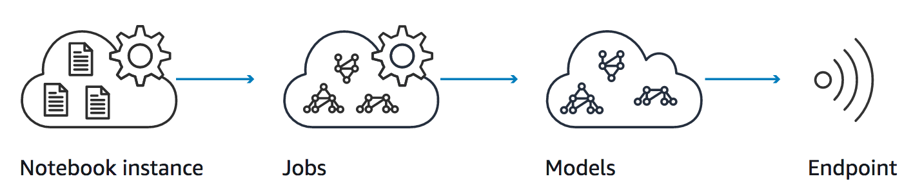

<!-- $theme: default -->

---

# Deep learning
###### Crash course

---

[comment]: <> ( AI - Intelligent through rules )
[comment]: <> ( ML - Self learning algorithm that train models using data )
[comment]: <> ( DL - ML using deep neural networks )

---

# Machine Learning categories

[comment]: <> ( description of ways in which you can let machines or algorithms loose on a data set )

### Supervised

[comment]: <> ( You know how the output/labels should look like )
[comment]: <> ( Predicting labels from examples/features )

### Unsupervised

[comment]: <> ( You don't know the structure of the data sets )
[comment]: <> ( Outcomes to most of the problems are largely unknown )

### Reinforcement

[comment]: <> ( Agents, Algorithms, Environment, State and Reward )
[comment]: <> ( monitor the response of the actions, and measure against a reward )

---

[comment]: <> ( This Hackathon - Supervised learning )

---

[comment]: <> ( data )
[comment]: <> ( model )
[comment]: <> ( loss function )
[comment]: <> ( optimizer - an algorithm to tweak the model params so that the loss function is minimized )

---

[comment]: <> ( Convolution - feature extraction. Based on assumption that information in images are spatially dependent )

---

---

# Sagemaker

---

---

[comment]: <> ( TensorFlow )

