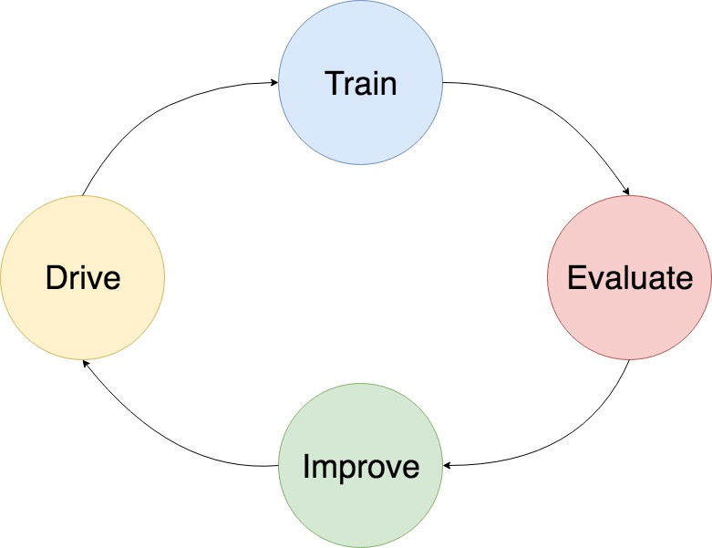
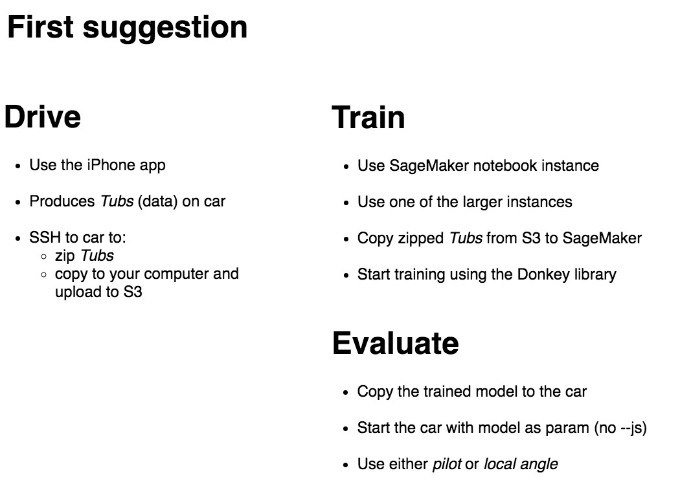

<!-- $theme: default -->

---

1.     ---------> Driving

2.     ---------> Machine Learning

3.     ---------> IoT

[comment]: <> ( There are lab instructions )
[comment]: <> ( You chose if/what you want to do )
[comment]: <> ( Don't follow them blindly. Takes too long time! )
[comment]: <> ( Some of it is already prepared, like calibration and naming the car )

---

[comment]: <> ( The basic workflow )

---

